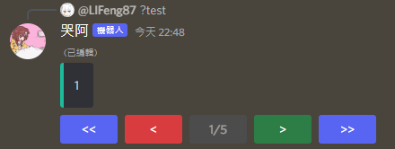

# discord-pages-handler
Create page with discord message

# Install
```
npm i discord-pages-handler
```

# Preview


# Example

## Create Pager
```javascript
const client = new Client();
const pager = new Pager({ client: client });
```
### create option
```typescript
interface {
	client: Client;
	frontButton?: ButtonBuilder;
	prevButton?: ButtonBuilder;
	pageButton?: ButtonBuilder;
	nextButton?: ButtonBuilder;
	lastButton?: ButtonBuilder;
};
```
## Create pages
You can create pages like...
```javascript
const pages = new PagesBuilder([
	{
		content: '1',
		embeds: [new EmbedBuilder().setDescription('1').setColor('Aqua')],
	},
	{
		content: '2',
		embeds: [new EmbedBuilder().setDescription('2').setColor('Aqua')],
	},
]);
```
```javascript
const pages = new PagesBuilder()
	.addPage((page) => page.setContent('1')
		.setEmbeds([new EmbedBuilder().setDescription('1').setColor('Aqua')]))
	.addPage((page) => page.setContent('2')
		.setEmbeds([new EmbedBuilder().setDescription('2').setColor('Aqua')]))
```
```javascript
const pages = new PagesBuilder().addPage({
	content: '1',
	embeds: [new EmbedBuilder().setDescription('1').setColor('Aqua')],
})
.addPage({
	content: '2',
	embeds: [new EmbedBuilder().setDescription('2').setColor('Aqua')],
});
```
## Handle Pages
```javascript
pager.handle(await message.reply(pages.getFirstPage()), pages)
pager.handle(await interaction.reply(pages.getFirstPage()), pages)
```
# Full Example
```javascript
const { Client, GatewayIntentBits, EmbedBuilder } = require('discord.js');
const { Pager, PagesBuilder } = require('discord-pages-handler');
const { token } = require('./config.json');

const client = new Client({
	intents: [
		GatewayIntentBits.Guilds,
		GatewayIntentBits.GuildMessages,
		GatewayIntentBits.MessageContent,
	],
});
const pager = new Pager({
	client: client,
});

client.on('messageCreate', async (message) => {
	if (message.content.startsWith('?test')) {
		const pages = new PagesBuilder([
			{
				content: '1',
				embeds: [new EmbedBuilder().setDescription('1').setColor('Aqua')],
			},
			{
				content: '2',
				embeds: [new EmbedBuilder().setDescription('2').setColor('Aqua')],
			},
		])
			.addPage((page) =>
				page
					.setContent('3')
					.setEmbeds([new EmbedBuilder().setDescription('3').setColor('Aqua')])
			)
			.addPage({
				content: '4',
				embeds: [new EmbedBuilder().setDescription('4').setColor('Aqua')],
			});

		pager.handlePage(await message.reply(pages.getFirstPage()), pages);
	}
});

client.once('ready', () => {
	console.log('Ready!');
});

client.login(token);
```